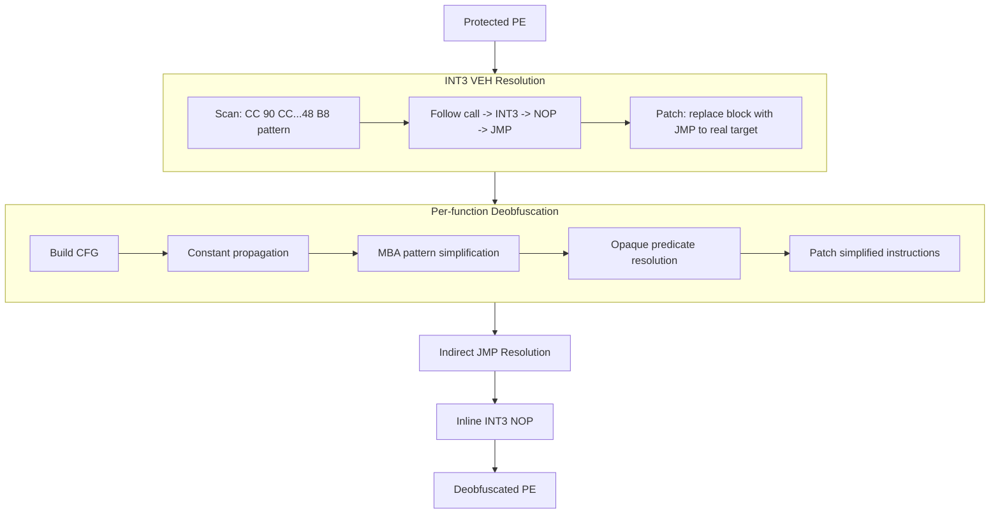
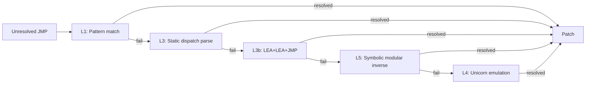
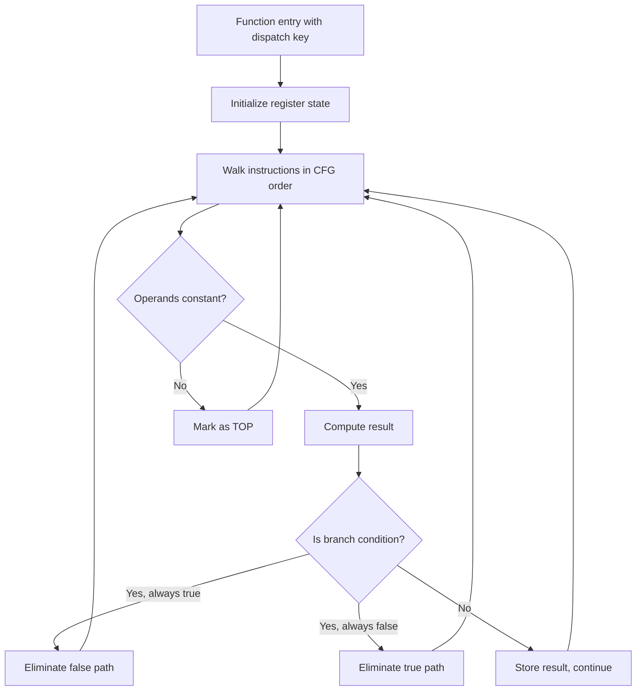
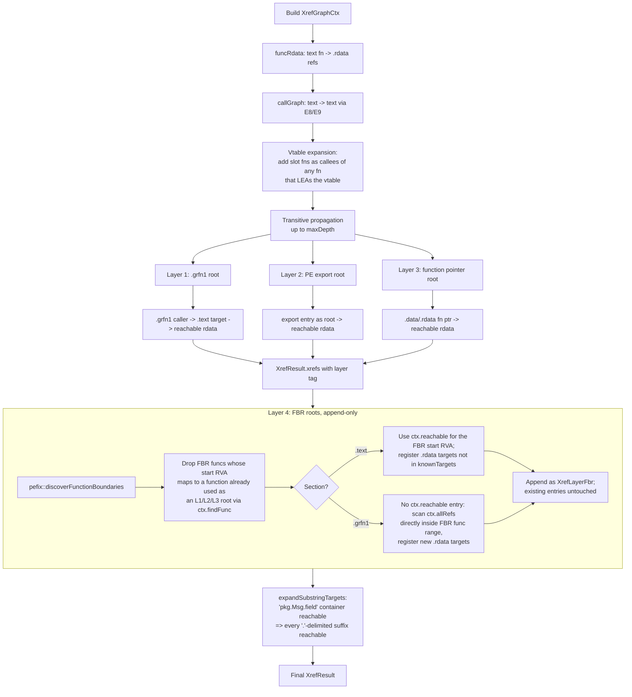
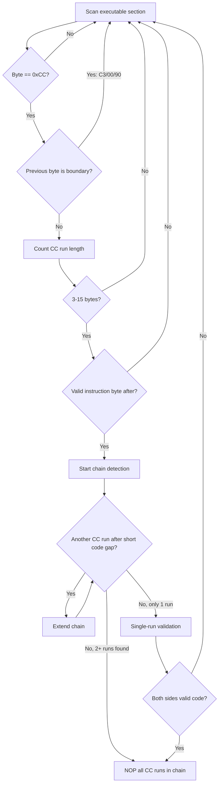

# Algorithms

## Full deobfuscation pipeline

## Indirect JMP resolution levels

## MBA constant propagation

## Layered xref reachability

L4 contributes *net-new* targets that the L1/L2/L3 propagation misses — typically
small `.text` functions reached only via FBR-discovered roots that none of pdata,
exports, fnptr tables, or `.grfn1` callers point at. The `.grfn1` branch exists
for completeness: when an FBR boundary lands inside `.grfn1`, the regular
`ctx.reachable` map (built from `.text`-only func starts) has no entry for it,
so its inner LEAs are picked up directly. In practice L1 already covers the
entire `.grfn1` LEA surface via its own BFS, so this branch usually adds 0
unique targets but is kept so the L4 set is symmetric across sections.

`strictOnly=true` restricts L4 roots to FBR boundaries backed by strong sources
(pdata / export / RTTI / EH) or multi-source agreement. In current builds this
produces an identical target count to the default — every weak FBR root's
reach is already covered by a strong-rooted FBR sibling — so the flag exists
mainly as a precision lever for future experiments.

## Inline INT3 NOP detection

