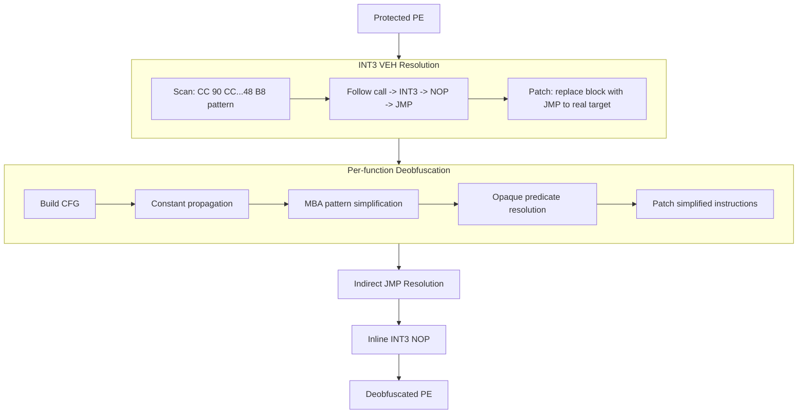
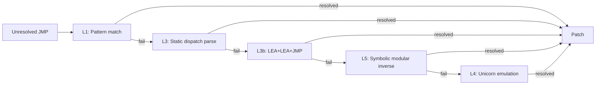
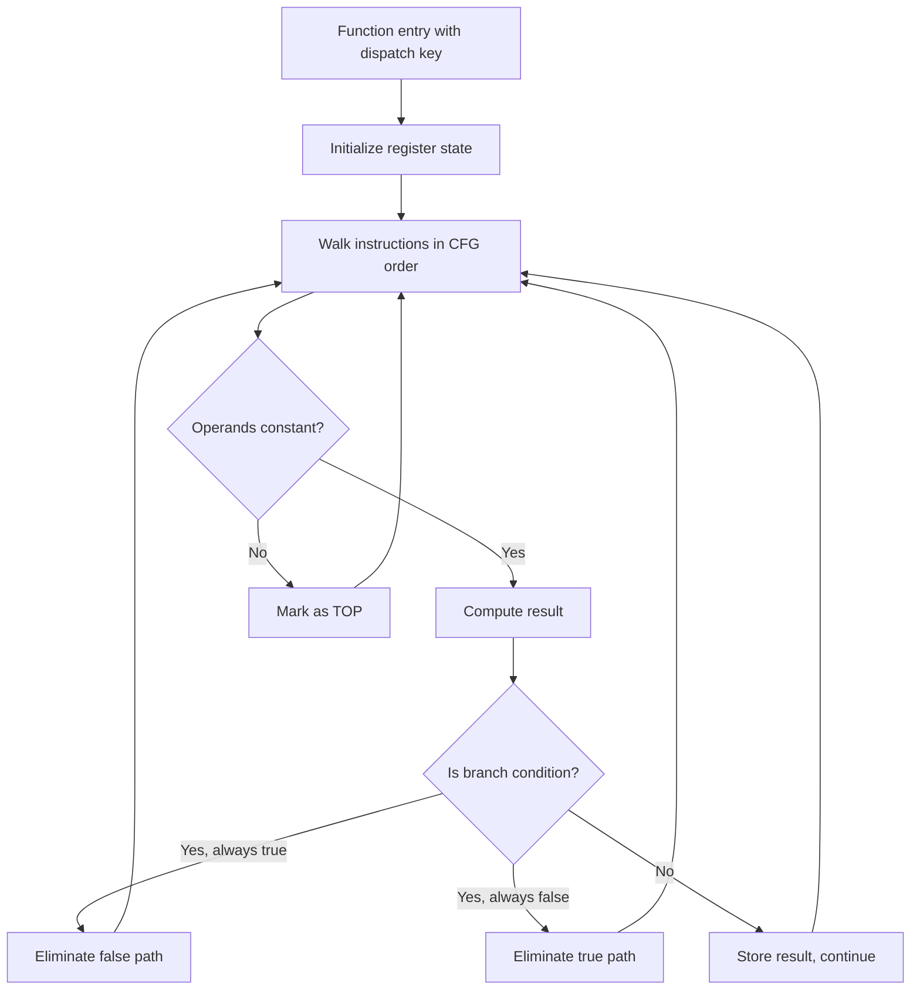
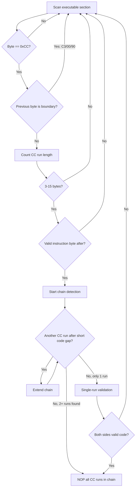

# libgriffin

Deobfuscation toolkit for binaries protected by the "Griffin" obfuscation engine.

"Griffin" is a community-assigned name derived from the `.grfn` section prefix found in protected binaries. The official product name is not publicly known. The engine is used in Riot Games' Vanguard and potentially other titles.

> This project was fully generated with AI assistance (Claude, Anthropic).

## Features

- **INT3 site resolution** — scan VEH dispatch sites, resolve real targets, patch to direct JMP
- **Indirect JMP resolution** — multi-level (pattern, constprop, symbolic, emulation)
- **Indirect CALL resolution** — same strategy for obfuscated function calls
- **MBA constant propagation** — fold Mixed Boolean Arithmetic into concrete values
- **Opaque predicate removal** — identify always-true/false conditions, eliminate dead paths
- **Inline INT3 NOP** — detect CC runs as inline constant data, convert to NOP
- **Nullsub patching** — remove dead code patterns in obfuscated sections
- **Binary patching** — apply all resolved results directly to the PE

## Build

Requires Visual Studio 2017+ with C++ desktop workload.
Depends on libpefix (expected at `../libpefix` or `deps/libpefix`).

```
build.bat
```

Output: `build\Release\libgriffin.exe`

## Usage

```
libgriffin.exe <input.exe> [options]
```

With no options, all deobfuscation passes are applied.

| Option | Description |
|--------|-------------|
| `-o <path>` | Output file (default: `input_deobf.exe`) |
| `--all` | Apply all passes (default) |
| `--int3` | INT3 handler resolution only |
| `--jmp` | Indirect JMP/CALL resolution only |
| `--mba` | MBA simplification only |
| `--dry-run` | Analyze only |
| `--verbose` | Detailed output |

## How it works

### Full deobfuscation pipeline



### Indirect JMP resolution levels



### MBA constant propagation



### Inline INT3 NOP detection



## As a library

```cpp
#include <pefix/pefix.h>
#include <griffin/griffin.h>

pefix::PEFile pe;
pe.load("protected.exe");
uint64_t base = pe.nt->OptionalHeader.ImageBase;

// INT3 sites
auto sites = griffin::scanInt3Sites(pe);
griffin::resolveInt3Targets(sites, pe);
griffin::patchInt3Sites(pe, base, sites);

// Inline INT3 NOP
auto nopStats = griffin::nopInlineInt3(pe);

pe.save("deobfuscated.exe");
```

## Project structure

```
include/griffin/        public headers
  griffin.h            master include + extended pseudo-ops
  dispatch.h           dispatch key extraction
  int3.h              INT3 VEH site scanning/resolution
  jmpres.h            indirect JMP/CALL resolution
  mba.h               MBA simplification + constant propagation
  patch.h             binary patching + inline INT3 NOP + nullsub
  output.h            text/IDC output formatting

src/                   implementation
tools/
  libgriffin.cpp       CLI entry point
  cli.h                colored console output
```

## Dependencies

- **libpefix** — PE parsing, x86-64 decoder, abstract interpreter

## License

MIT
